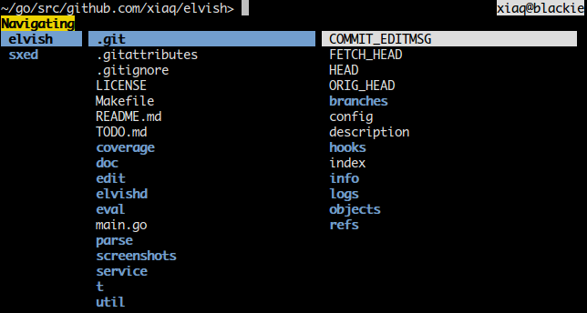

# An experimental Unix shell

This is a work in progress. Things may change and/or break without notice. You
have been warned...

Fancy badges:
[](http://godoc.org/github.com/elves/elvish)
[](https://travis-ci.org/elves/elvish)

## Obligatory screenshots
> I love software websites without screenshots of the actual thing.
> -- No one ever

Syntax highlighting (also showcasing right-hand-side prompt):


Tab completion for files:


Navigation mode (triggered with ^N, inspired by
[ranger](http://ranger.nongnu.org/)):



## Building

Go >= 1.4 is required. This repository is a go-getable package.

Linux is fully supported. I also try to ensure that it compiles on FreeBSD,
which means it will also likely compile on other BSDs and Mac OS X. Windows is
*not* yet supported, but it might be in future.

In case you are new to Go, you are advised to read [How To Write Go
Code](http://golang.org/doc/code.html), but here is a quick snippet:

```
export GOPATH=$HOME/go
export PATH=$PATH:$GOPATH/bin
go get github.com/elves/elvish
elvish
```

To update and rebuild:

```
go get -u github.com/elves/elvish
```

Remember to put the two `export`s above into your `bashrc` or `zshrc` (or
whatever).

Archlinux users can also try the AUR package
[elvish-git](https://aur.archlinux.org/packages/elvish-git/).

## Notes for Contributors

### Testing

Always run unit tests before committing. `make` will take care of this.

### Generated files

Some files are generated from other files. They should be commmited into the
repository for this package to be go-getable. Run `make pre-commit` to
re-generate them in case you modified the source. Read the Makefile for
details.

### Formatting the Code

Always format the code with `goimports` before committing. Run
`go get code.google.com/p/go.tools/cmd/goimports` to install `goimports`, and
`goimports -w .` to format all golang sources.

To automate this you can set up a `goimports` filter for Git by putting this
in `~/.gitconfig`:

    [filter "goimports"]
        clean = goimports
        smudge = cat

`.gitattributes` in this repository refers to this filter. Read more about Git
attributes and filters
[here](https://www.kernel.org/pub/software/scm/git/docs/gitattributes.html).

### Licensing

By contributing, you agree to license your code under the same license as
existing source code of Elvish. See the [License](#license) section.

## Name

In rogue-likes, items made by the elves have a reputation of high quality.
These are usually called **elven** items, but I chose **elvish** for obvious
reasons.

The adjective for elvish is also "elvish", not "elvishy" and definitely not
"elvishish".

I am aware of the fictional [elvish
language](https://en.wikipedia.org/wiki/Elvish_language), but I believe there
is not much room for confusion and the google-ability is still pretty good.

## The Editor

Those marked with ✔ are implemented (but could be broken from time to
time).

Like fish:

* Syntax highlighting ✔
* Auto-suggestion

Like zsh:

* Right-hand-side prompt ✔
* Dropdown menu completion ✔
* Programmable line editor

And:

* A vi keybinding that makes sense
* More intuitive multiline editing
* Some method to save typed snippets into a script
* A navigation mode for easier casual exploration of directories ✔

## The Language

(Like the previous section, only those marked with ✔ have been implemented.)

* Running external programs and pipelines, of course (`~>` represents the
  prompt): ✔
  ```
  ~> vim README.md
  ...
  ~> cat -v /dev/random
  ...
  ~> dmesg | grep bar
  ...
  ```

* Some constructs look like lisp without the outermost pair of parentheses: ✔
  ```
  ~> + 1 2
  ▶ 3
  ~> * (+ 1 2) 3
  ▶ 9
  ```

* Use single and double quotes to preserve spaces and special characters: ✔
  ```
  ~> echo "|  C'est pas une pipe."
  |  C'est pas une pipe.
  ```

* Barewords are string literals: ✔
  ```
  ~> = a 'a'
  ▶ $true
  ```

* Lists and maps admit indexing and are first-class values: ✔
  ```
  ~> println list: [a list] map: [&key &value]
  list: [a list] map: [&key value]
  ~> println [a b c][0]
  a
  ~> println [&key value][key]
  value
  ```

* Set variable with `set`: ✔
  ```
  ~> set v = [&foo bar]; put $v[foo]
  ▶ bar
  ```

* First-class closures, lisp-like functional programming:
  ```
  ~> map [x]{* 2 $x} [1 2 3]
  [2 4 6]
  ~> filter [x]{> $x 2} [1 2 3 4 5]
  [3 4 5]
  ~> map [x]{* 2 $x} (filter [x]{> $x 2} [1 2 3 4 5])
  [6 8 10]
  ```

* Get rid of lots of irritating superfluous parentheses with pipelines (`put`
  is the builtin for outputting compound data):
  ```
  ~> put 1 2 3 4 5 | filter [x]{> $x 2} | map [x]{* 2 $x}
  6 8 10
  ```

* Use the `env:` namespace for environmental variables: ✔
  ```
  ~> put $env:HOME
  ▶ /home/xiaq
  ~> set $env:PATH = $env:PATH":/bin"
  ```

The language is not yet complete. The issues list contain many of things
I'm currently thinking about.

## Motivation

This experiment has a number of motivations. Some of them:

* It attempts to prove that a shell language can be a handy interface to the
  operating system **and** a decent programming language at the same time; Many
  existing shells recognize the former but blatantly ignore the latter.

* It attempts to build a **better interface** to the operating system, trying
  to strike the right balance between the tool philosophy of Unix and the
  tremendous usefulness of a more integrated system.

* It also attempts to build a **better language**, learning from the success
  and failure of programming language designs.

* It attempts to exploit a facility Shell programmers are very familiar with,
  but virtually unknown to other programmers - the pipeline. That leads us to
  the topic of the next few sections.

