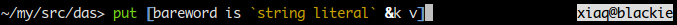
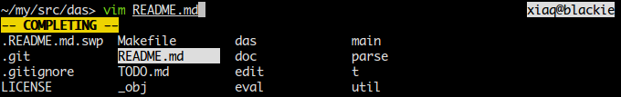

# An experimental Unix shell

This is a work in progress. Things may change and/or break without notice. You
have been warned...

Fancy badges:
[](https://godoc.org/github.com/xiaq/elvish)
[](https://travis-ci.org/xiaq/elvish)

## Obligatory screenshots
> All software websites should have screenshots.
> -- Someone on the Internet

Syntax highlighting (also showcasing right-hand-side prompt):



Tab completion:



## Building

Go >= 1.1.1 is required. This repository is a go-getable package.

In case you are new to Go, you are advised to read [How To Write Go
Code](http://golang.org/doc/code.html), but here is a quick snippet:

```
export GOPATH=$HOME/go
export PATH=$PATH:$GOPATH/bin
go get github.com/xiaq/elvish
elvish
```

To update and rebuild:

```
go get -u github.com/xiaq/elvish
```

Remember to put the two `export`s above into your `bashrc` or `zshrc` (or
whatever).

## Notes for Contributors

The `.gitattributes` in this repo dictates that go sources be filtered through
the `goimports` filter before checking in. If you would like to contribute,
you are advised to set up the filter:

1. Install `goimports`:

    ```
    go get code.google.com/p/go.tools/cmd/goimports
    ```

2. Put this in `~/.gitconfig`:

    ```
    [filter "goimports"]
        clean = goimports -tabwidth=4
        smudge = cat
        required
    ```

## Name

In rogue-likes, items made by the elves have a reputation of high quality.
These are usually called **elven** items, but I chose **elvish** for obvious
reasons.

The adjective for elvish is also "elvish", not "elvishy" and definitely not
"elvishish".

I am aware of the fictional [elvish
language](https://en.wikipedia.org/wiki/Elvish_language), but I believe there
is not much room for confusion and the google-ability is still pretty good.

## The Editor

Those marked with ✔ are implemented (but could be broken from time to
time).

Like fish:

* Syntax highlighting ✔
* Auto-suggestion

Like zsh:

* Right-hand-side prompt ✔
* Dropdown menu completion ✔
* Programmable line editor

And:

* A vi keybinding that makes sense
* More intuitive multiline editing
* Some method to save typed snippets into a script
* A "navigation mode" integrating functionalities of
  [ranger](http://ranger.nongnu.org/)

## The Language

(Like the previous section, only those marked with ✔ have been implemented.)

* Running external programs and pipelines, of course (`>` represents the
  prompt): ✔
  ```
  > vim README.md
  ...
  > cat -v /dev/random
  ...
  > dmesg | grep bar
  ...
  ```

* Some constructs look like lisp without the outermost pair of parentheses: ✔
  ```
  > + 1 2
  3
  > * (+ 1 2) 3
  9
  ```

* Use backquote for literal string (so that you can write both single and
  double quotes inside), double backquotes for a literal backquote: ✔
  ```
  > echo `"He's dead, Jim."`
  "He's dead, Jim."
  > echo `````He's dead, Jim."`
  ``He's dead, Jim."
  ```

* Barewords are string literals:
  ```
  > = a `a`
  true
  ```

* Tables are a hybrid of array and hash (a la Lua); tables are first-class
  values: ✔
  ```
  > println [a b c &key value]
  [a b c &key value]
  > println [a b c &key value][0]
  a
  > println [a b c &key value][key]
  value
  ```

* Declare variable with `var`, set value with `set`; `var` also serve as a
  shorthand of var-set combo: ✔
  ```
  > var v
  > set v = [foo bar]
  > var u = [foo bar] # equivalent
  ```

* First-class closures, lisp-like functional programming:
  ```
  > map {|x| * 2 $x} [1 2 3]
  [2 4 6]
  > filter {|x| > $x 2} [1 2 3 4 5]
  [3 4 5]
  > map {|x| * 2 $x} (filter {|x| > $x 2} [1 2 3 4 5])
  ```

* Get rid of lots of irritating superfluous parentheses with pipelines (`put`
  is the builtin for outputting compound data):
  ```
  > put [1 2 3 4 5] | filter {|x| > $x 2} | map {|x| * 2 $x}
  [6 8 10]
  ```

* Use the table `$env` for environmental variables:
  ```
  > put $env[HOME]
  /home/xiaq
  > set env[PATH] = $env[PATH]:/bin
  ```

There are many parts of the language that is not yet decided. See TODO.md for
a list of things I'm currently thinking about.

## Motivation

This experiment has a number of motivations. Some of them:

* It attempts to prove that a shell language can be a handy interface to the
  operating system **and** a decent programming language at the same time; Many
  existing shells recognize the former but blatantly ignore the latter.

* It attempts to build a **better interface** to the operating system, trying
  to strike the right balance between the tool philosophy of Unix and the
  tremendous usefulness of a more integrated system.

* It also attempts to build a **better language**, learning from the success
  and failure of programming language designs.

* It attempts to exploit a facility Shell programmers are very familiar with,
  but virtually unknown to other programmers - the pipeline. That leads us to
  the topic of the next few sections.

## Pipeline, the Good

### A Concatenative Programming Facility

Pipelines make for a natural notation of concatenative programming.

So what's concatenative programming? In some of its most common use cases, we
can say it's just functional programming without [lots of irritating
superfluous parentheses](http://xkcd.com/297/). Consider this fictional piece
of lisp to find in `strs`, a list of strings, all members containing "LOL",
transform them into upper case, sort them, and store them in another list
`lols`:

```
(def lols (sort (map upper-case
                     (filter (lambda (x) (contains? x "LOL")) strs))))
```

(See [Appendix A](#appendix-a) for this piece of code in real lisps.)

It looks OK until you try to read the code aloud:

> Put in `lols` what results from sorting what results from turning into upper
> case what results from filtering the strings that contain "LOL" in `strs`.

An deep hierarchy of parentheses map into a deep hierarchy of clauses. Worse,
this reads *backwards*.

What would you do it in shell, with pipelines? Assuming that the strings are
stored in the file `strs`, it is just:

```
lols=`cat strs | grep LOL | tr a-z A-Z | sort`
```

The historically weird names aside, it reads perfectly natural: assign to
`lols` the result of the following: take the lines in `strs`, find those
having "LOL", change them to upper case, and sort them. This matches our
description of the procedure except for the assignment. There is an obvious
restriction with this shell pipeline approach, but that will be the topic of
the next section.

Concatenative programming is the notion of building programs by connecting
data-transforming constructs together. In our case, the constructs are `cat
strs`, `grep LOL`, `tr a-z A-Z` and `sort`; the pipe symbol is the
connector. The interesting thing is that each construct itself is actually a
valid program; thus it could be said that a more complex program is formed by
*concatenating* simpler programs, hence the term "concatenative programming".
Compare this to the functional approach, where constructs are *nested* instead
of connected one after another.

### A Concurrency Construct

(TO BE WRITTEN)

## Pipeline, the Bad and the Ugly

(TO BE WRITTEN)

## License

BSD 2-clause license.  See LICENSE for a copy.

## Appendix A

This fictional lisp code:

```
(def lols (sort (map upper-case
                     (filter (lambda (x) (contains? x "LOL")) strs))))
```

written in Clojure:

```
(require ['clojure.string :refer '(upper-case)])
(def strs '("aha" "LOLaha" "hahaLOL" "hum?"))
(def lols (sort (map upper-case
                     (filter #(re-find #"LOL" %) strs))))
```

written in Racket:

```
(define strs '("aha" "LOLaha" "hahaLOL" "hum?"))
(define lols (sort (map string-upcase
                        (filter (lambda (x) (regexp-match? #rx"LOL" x)) strs))
                   string<?))
```

I'm by no means a Lisp hacker, so feel free to fire an issue if my code is not
idiomatic.
