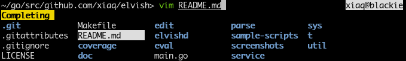
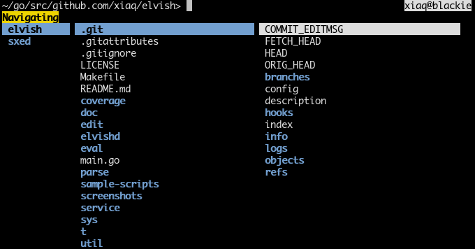

# A novel Unix shell

[](http://godoc.org/github.com/elves/elvish)
[](https://travis-ci.org/elves/elvish)

This project aims to explore the potentials of the Unix shell. It is a work in
progress; things will change without warning.


## The Interface

Syntax highlighting (also showcasing right-hand-side prompt):


Tab completion for files:



Navigation mode (triggered with ^N, inspired by
[ranger](http://ranger.nongnu.org/)):




Planned features:

* Auto-suggestion (like fish)
* Programmable line editor
* Directory jumping (#27)
* A vi keybinding that makes sense
* History listing (like
  [ptpython](https://github.com/jonathanslenders/ptpython))
* Intuitive multiline editing

## The Language

Some things that the language is already capable of:

* External programs and pipelines: (`~>` is the prompt):
  ```
  ~> vim README.md
  ...
  ~> cat -v /dev/random
  ...
  ~> dmesg | grep -i acpi
  ...
  ```

* Arithmetics using the prefix notation:
  ```
  ~> + 1 2
  ▶ 3
  ~> * (+ 1 2) 3
  ▶ 9
  ```

* Quoting:
  ```
  ~> echo "|  C'est pas une pipe."
  |  C'est pas une pipe.
  ```

* Lists and maps:
  ```
  ~> println list: [a list] map: [&key &value]
  list: [a list] map: [&key value]
  ~> println [a b c][0]
  a
  ~> println [&key value][key]
  value
  ```

* Variables:
  ```
  ~> set v = [&foo bar]; put $v[foo]
  ▶ bar
  ```

* Defining functions:
  ```
  ~> fn map [f xs]{ put [(put-all $xs | each $f)] }
  ```

* Lisp-like functional programming:
  ```
  ~> map [x]{+ 10 $x} [1 2 3]
  [11 12 13]
  ~> map [x]{/ $x 2} (map [x]{+ 10 $x} [1 2 3])
  [5.5 6 6.5]
  ```

* More natural concatenative style:
  ```
  ~> put 1 2 3 | each [x]{+ 10 $x} | each [x]{/ $x 2}
  ▶ 5.5
  ▶ 6
  ▶ 6.5
  ```

* A separate `env:` namespace for environmental variables:
  ```
  ~> put $env:HOME
  ▶ /home/xiaq
  ~> set $env:PATH = $env:PATH":/bin"
  ```

The language is not yet complete. Notably, control structures like `if` and
`while` are not yet implemented. The issues list contain some of things I'm
currently working on.

## Name

In [roguelikes](https://en.wikipedia.org/wiki/Roguelike), items made by the
elves have a reputation of high quality.  These are usually called **elven**
items, but I chose **elvish** for an obvious reason.

The adjective for elvish is also "elvish", not "elvishy" and definitely not
"elvishish".

It is not directly related to the fictional
[elvish language](https://en.wikipedia.org/wiki/Elvish_language), but I
believe there is not much room for confusion and the google-ability is still
pretty good.


## Building

Go >= 1.4 is required. This repository is a go-getable package.

Linux is fully supported. I also try to ensure that it compiles on FreeBSD,
which means it will also likely compile on other BSDs and Mac OS X. Windows is
*not* yet supported, but it might be in future.

In case you are new to Go, you are advised to read [How To Write Go
Code](http://golang.org/doc/code.html), but here is a quick snippet:

```
export GOPATH=$HOME/go
export PATH=$PATH:$GOPATH/bin
go get github.com/elves/elvish
elvish
```

To update and rebuild:

```
go get -u github.com/elves/elvish
```

Remember to put the two `export`s above into your `bashrc` or `zshrc` (or
whatever).

Archlinux users can also try the AUR package
[elvish-git](https://aur.archlinux.org/packages/elvish-git/).

## Notes for Contributors

### Testing

Always run unit tests before committing. `make` will take care of this.

### Generated files

Some files are generated from other files. They should be commmited into the
repository for this package to be go-getable. Run `make pre-commit` to
re-generate them in case you modified the source. Read the Makefile for
details.

### Formatting the Code

Always format the code with `goimports` before committing. Run
`go get code.google.com/p/go.tools/cmd/goimports` to install `goimports`, and
`goimports -w .` to format all golang sources.

To automate this you can set up a `goimports` filter for Git by putting this
in `~/.gitconfig`:

    [filter "goimports"]
        clean = goimports
        smudge = cat

`.gitattributes` in this repository refers to this filter. Read more about Git
attributes and filters
[here](https://www.kernel.org/pub/software/scm/git/docs/gitattributes.html).

### Licensing

By contributing, you agree to license your code under the same license as
existing source code of Elvish. See the [License](#license) section.

