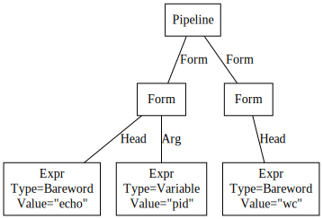
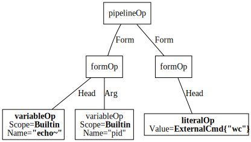
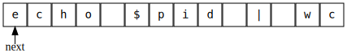
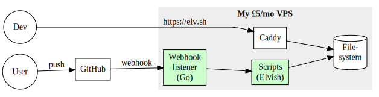

# Implementation of Elvish

# Or, how to write a programming language and shell in Go with 92% test coverage and instant CI/CD

Qi Xiao (xiaq)

2024-08-02 @ Recurse Center

***

# Agenda

-   What's Elvish?

-   Implementing the interpreter

-   Testing the interpreter

-   Testing the terminal app

-   Miscellaneous bits

***

# What's Elvish?

***

# Elvish is a modern shell

-   What's a shell?

    -   A programming language and terminal app

    -   ... that helps you interface with your operating system

    -   Traditional shells: Bourne sh, csh, ksh, dash, bash, zsh

-   What's a modern shell?

    -   Full-fledged programming language

    -   More powerful interactive features

    -   Other modern shells: [Nushell](https://www.nushell.sh),
        [Oils](https://www.oilshell.org), [Murex](https://murex.rocks)

***

# Traditional shell language features

-   Run external commands:

    ```elvish
    vim main.go
    ```

-   Wildcards, text pipelines:

    ```elvish
    cat *.go | wc -l
    # Elvish also supports recursive wildcards
    cat **.go | wc -l
    ```

-   Capturing output of commands:

    ```elvish
    # Like $(whoami) or `whoami` in traditional shells
    echo 'Greetings, '(whoami)'!'
    ```

***

# Modern language features

-   Lists:

    ```elvish
    var list = [foo bar [lorem ipsum]]
    echo $list[2][0]
    ```

-   Maps:

    ```elvish
    var speed = [&Go=[&compile=fast &run=OK]
                 &Rust=[&compile=slow &run=fast]]
    echo 'Go is '$speed[Go][compile]' to compile'
    ```

-   Value outputs and pipelines:

    ```elvish-transcript
    ~> str:split , 'Rob Pike,Ken Thompson,Robert Griesemer'
    ▶ 'Rob Pike'
    ▶ 'Ken Thompson'
    ▶ 'Robert Griesemer'
    ~> str:split , 'Rob Pike,Ken Thompson,Robert Griesemer' | str:join '|'
    ▶ 'Rob Pike|Ken Thompson|Robert Griesemer'
    ```

***

# Functional programming

-   Lambdas look like `{ code }` or `{|arg| code}`

-   Once you have them, they pop up everywhere

    ```elvish
    # Using a lambda for parallel execution
    peach {|h| ssh root@$h 'apt update'} [server-a server-b]
    # Timing a lambda
    time { sleep 1s }
    # The if-body is a lambda
    if (eq (uname) Darwin) { echo 'Hello macOS user!' }
    # Using a lambda to define the prompt
    set edit:prompt = { print (whoami)@(tilde-abbr $pwd)'$ ' }
    ```

***

# Interactive features

-   (Demo)

-   Syntax highlighting

-   Completion with <kbd>Tab</kbd>

-   Directory history with <kbd>Ctrl-L</kbd>

-   Command history with <kbd>Ctrl-R</kbd>

-   Filesystem navigator with <kbd>Ctrl-N</kbd>

***

# Implementing the Elvish interpreter

***

# Interpreter overview

-   An interpreter works in stages:

    1.  Parse: code → **syntax tree**

        Each node contains syntactical information

    2.  Compile: syntax tree → **op tree**

        Each node contains information for execution, and has an `exec` method

    3.  Execute: Call `exec` on op tree root

-   Every stage is divide-and-conquer on a tree structure

-   (A variant of tree walker)

***

# An example

-   Source code

    ```elvish
    echo $pid | wc
    ```

<div class="two-columns">
<div class="column">

-   Syntax tree:

    

    <!--
    digraph AST {
        node [shape = rectangle];
        edge [arrowhead = none];
        "Form echo" [label = "Form"];
        "Form wc" [label = "Form"];
        "Expr echo" [label = "Expr\nType=Bareword\nValue=\"echo\""];
        "Expr $pid" [label = "Expr\nType=Variable\nValue=\"pid\""];
        "Expr wc" [label = "Expr\nType=Bareword\nValue=\"wc\""];

        "Pipeline" -> "Form echo" [label = "Form"];
        "Form echo" -> "Expr echo" [label = "Head"];
        "Form echo" -> "Expr $pid" [label = "Arg"];
        "Pipeline" -> "Form wc" [label = "Form"];
        "Form wc" -> "Expr wc" [label = "Head"];
    }
    -->

</div>
<div class="column">

-   Op tree:

    

    <!--
    digraph optree {
        node [shape = rectangle];
        edge [arrowhead = none];
        "Pipeline" [label = "pipelineOp"];
        "Form echo" [label = "formOp"];
        "Form wc" [label = "formOp"];
        "Expr echo" [label = <<b>variableOp</b><br/>Scope=<b>Builtin</b><br/>Name=<b>"echo~"</b>>];
        "Expr $pid" [label = <variableOp<br/>Scope=<b>Builtin</b><br/>Name="pid">];
        "Expr wc" [label = <<b>literalOp</b><br/>Value=<b>ExternalCmd{"wc"}</b>>];

        "Pipeline" -> "Form echo" [label = "Form"];
        "Form echo" -> "Expr echo" [label = "Head"];
        "Form echo" -> "Expr $pid" [label = "Arg"];
        "Pipeline" -> "Form wc" [label = "Form"];
        "Form wc" -> "Expr wc" [label = "Head"];
    }
    -->

</div>
</div>

***

# Parsing

-   Parser state

    

    <!--
    digraph parser {
        nodesep = 0;
        ranksep = 0.3;
        node [shape=box, width=0.4, height=0.4, fixedsize=true];

        a [label="e" fontname="monospace"];
        b [label="c" fontname="monospace"];
        c [label="h" fontname="monospace"];
        d [label="o" fontname="monospace"];
        e [label=" " fontname="monospace"];
        f [label="$" fontname="monospace"];
        g [label="p" fontname="monospace"];
        h [label="i" fontname="monospace"];
        i [label="d" fontname="monospace"];
        j [label=" " fontname="monospace"];
        k [label="|" fontname="monospace"];
        l [label=" " fontname="monospace"];
        m [label="w" fontname="monospace"];
        n [label="c" fontname="monospace"];

        {rank=min; a; b; c; d; e; f; g; h; i; j; k; l; m; n}

        next [shape=none, label="next", height=0.1];
        next -> a;
    }
    -->

-   Parser operations

    -   *Peek*: look at what `next` points to

    -   *Consume*: move `next` forward

-   How do I parse a `Pipeline`?

    -   Divide and conquer: to parse a `Pipeline`, parse a `Form`, and if we see
        `|`, consume it and parse another `Form`

    -   How do I parse a `Form`?

        -   Divide and conquer: to parse a `Form`, parse an `Expr` (the head),
            and as long as we don't see `|` or newline, parse another `Expr` (an
            argument)

        -   How do I parse an `Expr`?

            -   ...

***

# Parsing a pipeline

```go
type parser struct { src string; next int }

type Pipeline struct { Forms []Form }

func parsePipeline(ps *parser) Pipeline {
                                   // To parse a Pipeline,
    forms := []Form{parseForm(ps)} // parse a Form,
    for ps.peek() == '|' {         // as long as we see '|',
        ps.next++                  // consume it,
        forms = append(forms, parseForm(ps)) // and parse another Form
    }
    return Pipeline{Forms}
}
```

-   [Real code](https://github.com/elves/elvish/blob/d8e2284e61665cb540fd30536c3007c4ee8ea48a/pkg/parse/parse.go#L132)

***

# Compiling a pipeline

```go
type pipelineOp struct { formOps []formOp }

func (cp *compiler) compilePipeline(p Pipeline) pipelineOp {
    formOps := make([]formOp, len(p.Forms))
    for i, f := range p.Forms {
        formOps[i] = compileForm(f)
    }
    return pipelineOp{formOps}
}
```

-   Similarly, divide and conquer

-   Compilation of other nodes is more interesting

-   [Real code](https://github.com/elves/elvish/blob/d8e2284e61665cb540fd30536c3007c4ee8ea48a/pkg/eval/compile_effect.go#L46)

***

# Execution

-   The `exec` method is where the real action happens

    ```go
    type pipelineOp struct { formOps []formOp }
    func (op *pipelineOp) exec() { /* ... */ }

    type formOp struct { /* ... */ }
    func (op *formOp) exec() { /* ... */ }
    ```

-   ```elvish
    echo $pid | wc
    ```

    How do we connect the output of `echo` to the input of `wc`?

-   You exist in the context of all in which you live

    ```go
    type Context struct {
        stdinFile *os.File; stdinChan <-chan any
        stdoutFile *os.File; stdoutChan chan<- any
    }

    func (op *pipelineOp) exec(*Context) { /* ... */ }
    func (op *formOp) exec(*Context) { /* ... */ }
    ```

***

# Executing a pipeline

```go
type pipelineOp struct { forms []formOp }

func (op *pipelineOp) exec(ctx *Context) {
    form1, form2 := forms[0], forms[1] // Assume 2 forms
    r, w, _ := os.Pipe()               // Byte pipeline
    ch := make(chan any, 1024)         // Channel pipeline
    ctx1 := ctx.cloneWithStdout(w, ch) // Context for form 1
    ctx2 := ctx.cloneWithStdin(r, ch)  // Context for form 2
    var wg sync.WaitGroup              // Now execute them in parallel!
    wg.Add(2)
    go func() { form1.exec(ctx1); wg.Done() }()
    go func() { form2.exec(ctx2); wg.Done() }()
    wg.Wait()
}
```

-   [Real code](https://github.com/elves/elvish/blob/d8e2284e61665cb540fd30536c3007c4ee8ea48a/pkg/eval/compile_effect.go#L69)

***

# Reviewing the example

-   Source code

    ```elvish
    echo $pid | wc
    ```

<div class="two-columns">
<div class="column">

-   Syntax tree:

    

</div>
<div class="column">

-   Op tree:

    

</div>
</div>

***

# Go is great for writing a shell

-   Pipeline semantics

    -   Text pipelines: [`os.Pipe`](https://pkg.go.dev/os#Pipe)

    -   Value pipelines: channels

    -   Concurrent execution: Goroutines and
        [`sync.WaitGroup`](https://pkg.go.dev/sync)

-   Running external commands:
    [`os.StartProcess`](https://pkg.go.dev/os#StartProcess)

***

# Go is great for writing an interpreted language

-   Rich standard library

    -   Big numbers ([`big.Int`](https://pkg.go.dev/math/big#Int) and
        [`big.Rat`](https://pkg.go.dev/math/big#Rat)):

        ```elvish-transcript
        ~> * (range 1 41) # 40!
        ▶ (num 815915283247897734345611269596115894272000000000)
        ~> + 1/10 2/10
        ▶ (num 3/10)
        ```

    -   [`math`](https://pkg.go.dev/math),
        [`strings`](https://pkg.go.dev/strings) (`str:` in Elvish),
        [`regexp`](https://pkg.go.dev/regexp) (`re:` in Elvish):

        ```elvish-transcript
        ~> math:log10 100
        ▶ (num 2.0)
        ~> str:has-prefix foobar foo
        ▶ $true
        ~> re:match '^foo' foobar
        ▶ $true
        ```

-   Garbage collection comes for free!

***

# Testing the Elvish interpreter

***

# How do you get to 90%+ test coverage?

-   Make writing tests *really* easy

-   Interpreters have a super simple API!

    -   Input: code

    -   Output: text, values

***

<!--
# Make code testable

-   Minimize dependencies

-   Make dependencies explicit

    -   Take them as arguments

        ```go
        func Hello(stdout os.Writer) { fmt.Fprintln(stdout, "Hello!") }
        ```

    -   Store them in global variables and swap them during tests

        ```go
        // in hello.go
        var stdout = os.Stdout
        func Hello() { fmt.Fprintln(stdout, "Hello!") }

        // in hello_test.go
        func TestHello(t *testing.T) {
            stdout = ...
            // ...
        }
        ```

***
-->

# Iteration 1: table-driven tests

```go
var tests = []struct{
    code string
    wantValues []any
    wantBytes string
}{
    {code: "echo foo", wantBytes: "foo\n"},
}

func TestInterpreter(t *testing.T) {
    for _, test := range tests {
        gotValues, gotBytes := Interpret(test.code)
        // Compare with test.wantValues and test.wantBytes
    }
}
```

***

# Adding a test case with table-driven tests

-   Steps:

    1.  Implement new functionality

    2.  Test manually in terminal:

        ```elvish-transcript
        ~> str:join , [a b]
        ▶ 'a,b'
        ```

    3.  Convert the interaction into a test case:

        ```go
        {code: "str:join , [a b]", wantValues: []any{"a,b"}}
        ```

-   Step 3 can get repetitive

    -   What if we let the computer do the conversion? 🤔

***

# Iteration 2: transcript tests

-   Record terminal *transcripts* in `tests.elvts`:

    ```elvish-transcript
    ~> str:join , [a b]
    ▶ 'a,b'
    ```

-   Generate the table from the terminal transcript:

    ```go
    //go:embed tests.elvts
    const transcripts string

    func TestInterpreter(t *testing.T) {
        tests := parseTranscripts(transcripts)
        for _, test := range tests { /* ... */ }
    }
    ```

***

# Adding a test case with transcript tests

-   Steps:

    1.  Implement new functionality

    2.  Test manually in terminal:

        ```elvish-transcript
        ~> str:join , [a b]
        ▶ 'a,b'
        ```

    3.  Copy the terminal transcript into `tests.elvts`

-   Copying is still work

    -   What if we don't even need to copy? 🤔

***

# Iteration 2.1: an editor extension for transcript tests

-   Editor extension for `.elvts` files

    -   Run code under cursor

    -   Insert output below cursor

-   Steps (demo):

    1.  Implement new functionality

    2.  Test manually in `tests.elvts` within the editor:

        ```elvish-transcript
        ~> use str
        ~> str:join , [a b]
        ▶ 'a,b'
        ```

***

<!--
# Implementing the terminal app

***

# Unix terminal IO 101

-   Inputs and outputs are just text!

    -   Until they're not

    -   Invisible characters to the rescue!

-   Input:

    -   <kbd>Ctrl-A</kbd> → `"\x01"`

    -   <kbd>F1</kbd> → `"\x1bOP"`

-   Output:

    -   Cursor control:

        -   `"\r"` sends cursor back to the start of the line

        -   `"\x1b[K"` erases the current line from the cursor

    -   Style control: `"\x1b[31m"` changes the foreground color to red

-   [Canonical reference](https://invisible-island.net/xterm/ctlseqs/ctlseqs.html)

***

# Reader and writer

-   The reader converts text input with escape sequences to keys

    ```go
    func newReader(r io.Reader) Reader
    type Reader interface { ReadEvent() Event }
    ```

    Example: `"a\x1bOP"` → <kbd>a</kbd> <kbd>F1</kbd>

-   The writer convert internal rich text buffer to text output with escape
    sequences

    ```go
    func newWriter(w io.Writer) Writer
    type Writer interface { WriteBuffer(Buffer) }
    ```

    Example: <code><font color="red">Error:</font> foo</code> →
    `"\x1b[31mError:\x1b[m foo"`

-   The writer also uses cursor control to erase existing content on subsequent
    writes

    Example: `foo` → `"\r\x1b[Kfoo"`

***

# Widget and event loop

```go
type Widget interface {
    Render(width, height int) Buffer
    Handle(event Event)
}

func eventLoop(w Widget) {
    writer.WriteBuffer(w.Render(80, 24))
    for {
        event := readEvent()
        w.Handle(event)
        writeBuffer(w.Render(80, 24))
    }
}
```

***
-->

# Testing the terminal app

***

# Widget abstraction

-   Like GUI apps, Elvish's terminal app is made up of *widgets*

    ```go
    type Widget interface {
        Handle(event Event)
        Render(width, height int) *Buffer
    }
    ```

-   `Buffer`: stores *rich text* and the cursor position

-   `Event`: keyboard events (among others)

-   Example: `CodeArea`

    -   Stores text content and cursor position

    -   `Render`: writes a `Buffer` with current content and cursor

    -   `Handle`:

        -   <kbd>a</kbd> → insert `a`

        -   <kbd>Backspace</kbd> → delete character left of cursor

        -   <kbd>Left</kbd> → move cursor left

***

# Widget API is also simple(-ish)

-   Input: `Event`

-   Output: `Buffer`

-   But:

    -   Multiple inputs and outputs, often interleaved.

        A typical test:

        1.  Press <kbd>x</kbd>, press <kbd>y</kbd>, render and check

        2.  Press <kbd>Left</kbd>, render and check

        3.  Press <kbd>Backspace</kbd>, render and check

    -   Tests end up verbose and not easy to write 😞

***

# Leveraging Elvish and transcript tests!

<div class="two-columns">
<div class="column">

-   Create Elvish bindings for the widget

-   Now just use Elvish transcript tests

    ```elvish-transcript
    ~> send-keys [x y]; render
    xy
    ~> send-keys [Left]; render
    xy
    ~> send-keys [Backspace]; render
    y
    ```

</div>
<div class="column">

Actual output of `render` is slightly more sophisticated...

```elvish-transcript
~> send-keys [x y]; render
┌────────────────────────────────────────┐
│xy                                      │
│   ̅̂                                     │
└────────────────────────────────────────┘
~> send-keys [Left]; render
┌────────────────────────────────────────┐
│xy                                      │
│  ̅̂                                      │
└────────────────────────────────────────┘
~> send-keys [Backspace]; render
┌────────────────────────────────────────┐
│y                                       │
│ ̅̂                                       │
└────────────────────────────────────────┘
```

</div>
</div>

***

# Miscellaneous bits

***

# Continuous deployment



<!--
digraph continuous_deployment {
  rankdir = LR
  node [shape=box]

  subgraph cluster_0 {
    style=filled;
    color="#eeeeee";
    label = <<b>My £5/mo VPS</b>>
    node [style=filled fillcolor=white];
    webhook_listener [label="Webhook\nlistener\n(Go)" style=filled fillcolor="#ccffcc"]
    scripts [label="Scripts\n(Elvish)" style=filled fillcolor="#ccffcc"]
    filesystem [shape="cylinder" label="File-\nsystem"]
    
    webhook_listener -> scripts
    scripts -> filesystem
    caddy -> filesystem
  }

  dev [shape=circle label="User"]
  user [shape=circle label="Dev"]
  github [label="GitHub"]
  caddy [label="Caddy"]
  { rank = same; dev; user }
  dev -> github [label="push"]
  github -> webhook_listener [label="webhook"]
  user -> caddy [label="https://elv.sh"]
}
-->

-   Go is a great language to write a web server with

-   Elvish is a great language for scripting

-   <https://github.com/elves/up>

***

# Personal perspectives

-   Project goes back to 2013 (Go 1.1)

    -   Go 1.1 was already a solid language for writing Elvish

    -   Modules (1.11), generics and fuzzing (1.18) were more impactful changes

-   But I wish Go has...

    -   Nil safety

    -   Plugin support on more platforms (for native modules)

-   Interpreter is sophisticated but not a lot of code

    -   Focuses on simplicity, not very performant

-   The terminal app is a *lot* of code

***

# More about Elvish

-   Website: <https://elv.sh/>

    -   Get Elvish: <https://elv.sh/get/>

        ```elvish
        curl -so - https://dl.elv.sh/darwin-arm64/elvish-HEAD.tar.gz |
          sudo tar -xzvC /usr/local/bin
        ```

        No need for `curl ... | sh`, it's literally one binary :)

-   GitHub repo: <https://github.com/elves/elvish>

    Developer docs: <https://github.com/elves/elvish/tree/master/docs>

***

# Q&A
